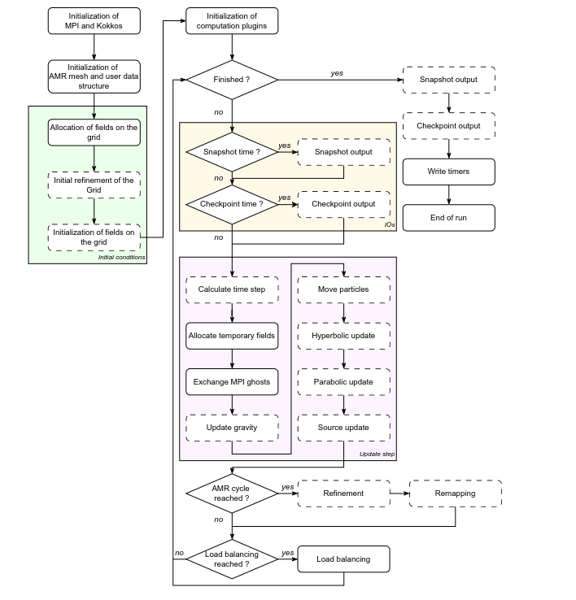

# Plugins in Dyablo

Until now we have used a lot the word **plugin**. And everytime, we promised to get back to it. Now is the time ! In this section we will discuss what plugins are, and we will see how to implement a plugin in Dyablo. This will all be very abstract but fortunately, in the next two tutorials we will see how to implement concrete plugins step by step.


## What is a plugin

A plugin is one of the basic bricks of Dyablo. Let's take a look at the general workflow of Dyablo:



A lot is happening but let's focus for now on the **update step**: the pink box in the middle. This update step is the meat of Dyablo, for every timestep, all these operations are chained in the code. As you can see on the diagram some boxes are in **solid lines** while others in **dashed lines**. The dashed line correspond to features encapsulated in a **plugin**.

For instance, the **Hyperbolic update** is a plugin because we want this section of the code to be modular. The hyperbolic update can solve the hydrodynamics equations, or the magneto-hydrodynamics equations, or the radiative-hydrodynamics equations. If we want to compare a run with and without magnetic field, we don't necessarily want to recompile the code to test both options. So this treatment is made as a plugin that can be changed at runtime between a selection.

The same is true for every dashed lines: initial conditions, IOs, calculation of the timestep, update of the various equations, refinement criterion or remapping. All these treatments can be changed at runtime.

For this, Dyablo uses a [factory](https://refactoring.guru/design-patterns/factory-method). Each feature of the code is made into an **abstract class**. Every implementation of one of these abstract classes is **registered** to its corresponding factory. So when Dyablo starts, every factory knows the list of available plugins. Dyablo then reads the `.ini` file and can ask each factory for the corresponding plugin. If the plugin does not exist in the factory, the code exits with an error and lists all the available plugins in the factory.

## How to create a plugin

The code for any given plugin is gathered in an C++ class that is instantiated during the initialization phase of the simulation using a factory according to the parameters given in the .ini file. To add a plugin, you will need to do three things: 

1. Write an implementation class for one of the abstract classes that can be used for plugins and then register your implementation to the corresponding factory, and
2. Register the implementation in the factory
3. Add the file to the compilation list in `core/src/CMakeLists.txt`

### Writing an implementation for your plugin

You first need to find the base class for the type of plugin you want to implement. For example :

* For hyperbolic/hydro kernels, you need to implement the `HyperbolicUpdate` interface (Example: `HydroUpdate_euler`);
* For refinement criteria, the `RefineCondition` interface (Example: `RefineCondition_pseudo_gradient`);
* To change how IOs or post processing are handled, implement the `IOManager` interface (Example: `IOManager_hdf5`)

You need to define a new class that inherits the abstract interface you have chosen, implements all the virtual methods and a constructor compatible with the associated factory.

For each feature, you can find the abstract class in the corresponding folder, under the name `<CLASS_NAME>_base.h`. For instance, let's say we want to write a new `IOManager`, then the abstract class will be in `core/src/ios/IOManager_base.h`. Let's take a look at this class:

```c++
/**
 * Base class for IO manager
 * 
 * IO manager is configured and instanciated during initialisation with the IOManagerFactory 
 * save_snapshot() can then be called at any timestep to output a snapshot
 **/
class IOManager{
public: 
  // IOManager(
  //               ConfigMap& configMap,
  //               ForeachCell& foreach_cell,
  //               Timers& timers );
  virtual ~IOManager(){}

  /**
   * Output simulation snapshot to a file
   * @param U, Ughost : Simulation data
   * @param iter iteration number
   * @param time physical time of the simulation
   **/
  virtual void save_snapshot( const UserData& U, ScalarSimulationData& scalar_data ) = 0;
};
```

and the associated factory is defined below as:

```c++
using IOManagerFactory = RegisteringFactory< IOManager, 
  ConfigMap& /*configMap*/,
  ForeachCell& /*foreach_cell*/,
  Timers& /*timers*/ >;
```

To create a new plugin for this factory, you will need to create a compatible implementation in a separate C++ file. For this specific factory, that means a new class that must:

* Inherit `IOManager` (the first template of the `RegisteringFactory`)
* Implement the constructor `IOManager(ConfigMap&, ForeachCell&, Timers&). Note that the parameters of the constructor must match the templates of the registering factory.
* Implement the `save_snapshot` method.

For this example, let's create a new `IOManager`. It will simply print a message on the standard output for the sake of the test. Let's start by creating a new file in `core/src/io/` and call it `IOManager_print.cpp`. 

The first thing we do is include the header `IOManager_base.h` to have access to the `IOManager` class, then we implement the new class inside the namespace `dyablo` which is the standard namespace where we put every class related to Dyablo: 

```c++
#include "IOManager_base.h"

namespace dyablo {

/**
 * @brief This IOManager prints a message "I'm not saving anything to the disk !" whenever it is called
 */
class IOManager_print : public IOManager{
public: 
  IOManager_print(
    ConfigMap& configMap,
    ForeachCell& foreach_cell,
    Timers& timers )
  : foreach_cell(foreach_cell)
  {}

  void save_snapshot( const UserData& U_, ScalarSimulationData& scalar_data )
  {
    std::cout << "I'm not saving anything to the disk !" << std::endl;
  }
  
private:
  ForeachCell& foreach_cell;
};

} // namespace dyablo
```

Of course, in a real IO backend, you would have a lot more code in the `save_snapshot` method, where you would most definitely open a file and write things. But for the sake of the example here, we simply print here. Now that we have implemented a new class, we need to register it in the factory.

### Registering the class in the factory

We register the class in the factory at the end of the `.cpp` file using the `FACTORY_REGISTER` macro. After closing the namespace, simply add: 

```c++
FACTORY_REGISTER( dyablo::IOManagerFactory, dyablo::IOManager_print, "IOManager_print" );
```

This line indicates that we want to add a new class to the `IOManagerFactory` factory, this class is our new implementation `IOManager_print`. Finally, the last parameter indicates the name we will write in the `.ini` file to refer to this implementation.

### Adding the file to the `CMakeLists.txt`

Right now we have created a new `.cpp` file, but we still need to add it to the compilation system otherwise the file will simply be ignored. Go ahead and open `core/src/CMakeLists.txt`. In there, simply add the file to the list of files to compile. As much as possible, try to keep the files grouped by plugin type. For instance here you can see the other IO plugins and add the new file to the list: 

```CMake
set( hdf5_src
    ${CMAKE_CURRENT_SOURCE_DIR}/io/IOManager_hdf5.cpp
    ${CMAKE_CURRENT_SOURCE_DIR}/io/IOManager_checkpoint.cpp
    ${CMAKE_CURRENT_SOURCE_DIR}/io/IOManager_diagnostics.cpp
    ${CMAKE_CURRENT_SOURCE_DIR}/io/IOManager_print.cpp
```

Now compile the code. Once compilation is done, let's test the new plugin. Go to the `bin` folder where the executable of Dyablo is and open `test_blast_2d_block.ini`. In there, in the `[run]` section, add `output_timeslice=0.01` and in the `[output]` section add `backend=IOManager_print`. Run the code using that `.ini` file. You should have plenties of prints saying that nothing is saved to the disk !

```
Output: scalar_data : iter=0 aexp=1 dt=1 time=0 
I'm not saving anything to the disk !
scalar_data : iter=0 aexp=1 dt=0.00153124 time=0 
Mesh - rank 0 octs : 124 (0)
Reallocate : add fields 5 -> 10
Output: scalar_data : iter=8 aexp=1 dt=0.00129382 time=0.0109044 
I'm not saving anything to the disk !
scalar_data : iter=10 aexp=1 dt=0.00130354 time=0.0134997 
Mesh - rank 0 octs : 148 (0)
Output: scalar_data : iter=15 aexp=1 dt=0.00132024 time=0.020063 
I'm not saving anything to the disk !
scalar_data : iter=20 aexp=1 dt=0.00133015 time=0.026696 
Mesh - rank 0 octs : 160 (0)
Output: scalar_data : iter=23 aexp=1 dt=0.00132816 time=0.0306833 
I'm not saving anything to the disk !
scalar_data : iter=30 aexp=1 dt=0.00133463 time=0.0399899 
Mesh - rank 0 octs : 172 (0)
Output: scalar_data : iter=31 aexp=1 dt=0.00133463 time=0.0413245 
I'm not saving anything to the disk !
Output: scalar_data : iter=38 aexp=1 dt=0.00133518 time=0.0506715 
I'm not saving anything to the disk !
scalar_data : iter=40 aexp=1 dt=0.00133657 time=0.0533426 
Mesh - rank 0 octs : 220 (0)
Output: scalar_data : iter=45 aexp=1 dt=0.00134296 time=0.0600398 
I'm not saving anything to the disk !
scalar_data : iter=50 aexp=1 dt=0.001363 time=0.066799 
Mesh - rank 0 octs : 184 (0)
Output: scalar_data : iter=53 aexp=1 dt=0.00138143 time=0.0709183 
I'm not saving anything to the disk !
Output: scalar_data : iter=60 aexp=1 dt=0.00141295 time=0.0806949 
I'm not saving anything to the disk !
scalar_data : iter=60 aexp=1 dt=0.00142039 time=0.0806949 
Mesh - rank 0 octs : 184 (0)
Output: scalar_data : iter=67 aexp=1 dt=0.00148078 time=0.0908323 
I'm not saving anything to the disk !
scalar_data : iter=70 aexp=1 dt=0.00152765 time=0.0953529 
Mesh - rank 0 octs : 232 (0)
I'm not saving anything to the disk !
Final scalar_data : iter=74 aexp=1 dt=4.54136e-05 time=0.1
```

Congratulations ! You have written your first plugin ! It is utterly useless but it works ! Let's try to do something more interesting now by writing a new initial conditions. Whenever you are ready, move to the [next tutorial](initial_conditions).