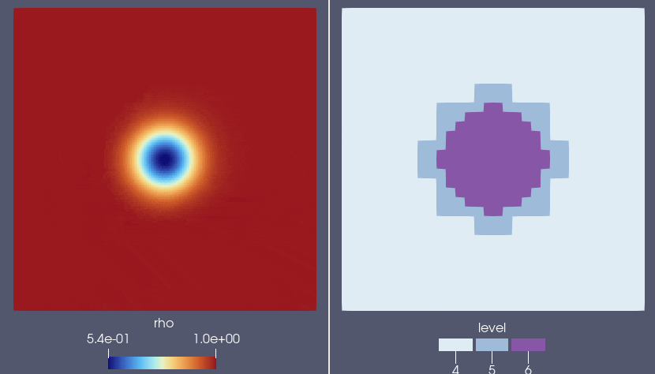

# Creating a new initial conditions

In this tutorial, we will write a new initial condition. Initial conditions are plugins as well, so you can follow the same principles as in the previous tutorial: 

1. Look at the base abstract class in `core/src/InitialConditions_base.h`
2. Create a new implementation of the class in a file
3. Register it in the factory
4. Add it to the `CMakeLists.txt`

However, initial conditions are a bit peculiar. For a lot of initial conditions what you need is to go through all the cells in the domain and return a value for a given position and cell-size, we have created a helper for this: the `InitialConditions_analytical<>` class.

## Using the `InitialConditions_analytical<>` helper

This helper has two purposes: 

1. Provide an easy way to initialize the domain
2. Hide the complexity of the initial mesh refinement by doing it for the user

The second point is important because initializing a domain with adaptive mesh refinement usually requires to do multiple cycles, and refine progressively the domain. This helper does everything for you by using the same refinement method as for the rest of the run.

`InitialConditions_analytical<Analytical_formula>` is a template class that takes an `AnalyticalFormula` class as a template parameter and uses the methods of this class to initialize the mesh and the fields. In practice, you simply need to create a class that derives from `Analytical_formula`. When registering, we will use `InitialConditions_analytical` and use our new class as a template.

## Using `AnalyticalFormula`

An `AnalyticalFormula` class has the following structure: 

```c++
struct MyAnalyticalFormula: public AnalyticalFormula_base_class 
{
  // ... Class attributes for initialization ...

  // Constructor
  MyAnalyticalFormula( ConfigMap& configMap ) 
  {
    // ...
  }

  KOKKOS_INLINE_FUNCTION
  State value(real_t x, real_t y real_t z, real_t dx, real_t dy, real_t dz) const
  {
    State result{};
    // Here: fill in the result variable
    return result;
  }
};
```

{: .note}
> **Classes vs structs**
> 
> Although we are speaking about classes, you might have noticed that we are using a `struct` here. In C++, a `struct` is a class with only public members.

A couple of things here are of importance: 

* `AnalyticalFormula_base_class` is actually a base class you need to pick and include. This class will be the one that defines what `State`, the conservative state the initial conditions will write, is. Two example of base classes you can find natively in Dyablo : `AnalyticalFormula_base_hydro` for hydrodynamics variables (density, momentum, total energy), and `AnalydicalFormula_base_MHD` for MHD variables (density, momentum, total energy, magnetic field). Look for the examples in `core/src/init` to see how to include and use these.
* `KOKKOS_INLINE_FUNCTION` tells the compiler the next function or method is going to be executed on the device. That means that if you compile for a GPU backend, this method will execute on the GPU.
* The `const` at the end of the declaration of `value` means the class (`MyAnalyticalFormula`) will not be modified when the method is called. It is a requisite of any `KOKKOS_INLINE_FUNCTION`.

Then, we need to register the initial conditions. Note that the registering factory for initial conditions expect a class that implements the `InitialConditions_base` abstract class, so you **cannot** register directly `MyAnalyticalFormula`. Instead we use a `InitialConditions_analytical` templated with our formula: 

```c++
FACTORY_REGISTER(dyablo::InitialConditionsFactory,
                 dyablo::InitialConditions_analytical<dyablo::MyAnalyticalFormula>, 
                "my_analytical_formula");
```

Now this might seem a bit abstract, so let's practice by adding a concrete new initial condition and trying a run.

## 2D vortex in an isentropic flow

Let's implement an isentropic vortex. For this, we will base ourselves on this [definition of the problem](https://www.cfd-online.com/Wiki/2-D_vortex_in_isentropic_flow). This problem is made for the Euler equations, and thus we will use the `AnalyticalFormula_base_hydro` class as a base. 

For this problem we have the traditional set of conservative variables for compressible hydrodynamics: density (`rho`), momentum (`rho_u`, `rho_v`) and total energy (`e_tot`). We also have a set of primitive variables: density (`rho`), velocity (`u`, `v`) and gas pressure (`p`). We use an ideal gas equation of state so we can convert from the conservative variables to the primitive variables and inversely. The problem is initialized using a constant background and a perturbation on top of it. Let's start with the includes, namespace and class declaration then we will add parameters to the plugin, and finally we will calculate the values to fill the grid.

### Skeleton of plugin

We will call our class `AnalyticalFormula_isentropic_vortex`. Let's create a `cpp` file in `core/src/init/hydro/AnalyticalFormula_isentropic_vortex.cpp` and start by creating a skeleton of class. We will fill it progressively.

```c++
#include "../InitialConditions_analytical.h"
#include "AnalyticalFormula_base_hydro.hpp"

namespace dyablo {

/**
 * @brief Isentropic vortex setup based on https://www.cfd-online.com/Wiki/2-D_vortex_in_isentropic_flow
 **/
struct AnalyticalFormula_isentropic_vortex : public AnalyticalFormula_base_hydro
{
  // Constructor
  AnalyticalFormula_isentropic_vortex(ConfigMap &configMap) 
  {
    // The constructor instructions will go here
  }

  // Method called on each cell of the domain, potentially multiple times
  KOKKOS_INLINE_FUNCTION
  State value(real_t x, real_t y, real_t z, real_t dx, real_t dy, real_t dz) const
  {
    State result{};

    return result;
  }
};
} // Namespace dyablo
```

Let's also immediately register the class in the factory:

```c++
FACTORY_REGISTER(dyablo::InitialConditionsFactory, 
                 dyablo::InitialConditions_analytical<dyablo::AnalyticalFormula_isentropic_vortex>, 
                 "isentropic_vortex");
```

While we're at it, let's edit `core/src/CMakeLists.txt` and add the new file to the compilation list (for example in `set( ic_src`)

```cmake
    ${CMAKE_CURRENT_SOURCE_DIR}/init/hydro/InitialConditions_isentropic_vortex.cpp
```

Now if we build the project, the new plugin should be compiled, and return no error hopefully !

### Reading input parameters

Now that we have the skeleton, we will declare our parameters in the class, and read them from the `.ini` file. For this last part, we use the `ConfigMap` object that allows us to access to the values stored in the `.ini` file, or give a default value. The way to use this object is straightforward : 

```c++
real_t      real_value = configMap.getValue<real_t>("section", "key", 1.0);
bool        bool_value = configMap.getValue<bool>("section", "my_bool", true);
int         int_value  = configMap.getValue<int>("section", "my_int", 10);
std::string str_value  = configMap.getValue<std::string>("section", "my_string", "Default value");
```

The type of the return value is fed as a template parameter (eg `<real_t>`) to the `getValue` method. Then we provide the section and the key of the `.ini` file where we want to read a value, and finally we can provide a default value if the section/key is not found in the file. If the default value is not provided and no value is given in the `.ini` file, Dyablo will throw an exception.

We can now read the parameters in the constructor. For the parameters that can be directly read from the config map it is possible to use a [member initializer list](https://www.learncpp.com/cpp-tutorial/constructor-member-initializer-lists/). For the rest they have to be initialized in the body of the constructor. 

The next thing we need to do is to define what are the free parameters of the problem from the description of the problem, the free parameters are:

* The initial velocity (`u0` and `v0`)
* The initial position of the vortex (`x0`, `y0`)
* The amplitude of the vortex (`beta`)

These parameters are declared as attributes of the class and initialized in the constructor. An additional attribute is required: the adiabatic index `gamma0` to convert from primitive to conservative variables. Lets start by declaring these parameters at the top of the structure:

```c++
struct AnalyticalFormula_isentropic_vortex : public AnalyticalFormula_base_hydro
{
  const real_t u0, v0;   // Initial velocity of the vortex
  const real_t beta;     // Perturbation amplitude
  const real_t x0, y0;   // Center of the vortex
  const real_t gamma0;   // Adiabatic index

  [...]
```

{: .note}
> **`const` this, `const` that**
>
> As you can see we mark a lot of attributes as constants. Whenever you know a value must be a constant, mark it as such. This is a good practice to follow and has two main purposes:
> 1. It helps you avoid bugs: modifying a `const` qualified attribute will generate a compilation error.
> 2. It helps the compiler optimize the code. 

Now these attributes are declared, we can initialize them in the constructor. All of them can be directly read from the config map, so we can use the initializer lists and leave the body of the constructor empty:

```c++
  AnalyticalFormula_isentropic_vortex(ConfigMap &configMap) :
    u0(  configMap.getValue<real_t>("isentropic_vortex", "u0",   1.0)),
    v0(  configMap.getValue<real_t>("isentropic_vortex", "v0",   1.0)),
    beta(configMap.getValue<real_t>("isentropic_vortex", "beta", 5.0)),
    x0(  configMap.getValue<real_t>("isentropic_vortex", "x0",   5.0)),
    y0(  configMap.getValue<real_t>("isentropic_vortex", "y0",   0.0)),
    
    gamma0(configMap.getValue<real_t>("hydro", "gamma0", 1.666666667))
  {}
```

{: .note}
> **The adiabatic index**
>
> As you see, the adiabatic index is something that is already available in the `hydro` section, so no need to declare it again in the `isentropic_vortex` section.

### Calculating the values

On to the final part of the tutorial. Now that we have our free-parameters read from the `.ini` file, the only thing left is to calculate the value of our cell. We will only use the 2D position here since the problem is 2D and not depending on the size of the cell. We start by calculating the distance of the current cell to the center of the vortex and the amplitude perturbation for the velocity: 

```c++
    // Distance to the center of the vortex and perturbation amplitude
    const real_t r2 = (x-x0)*(x-x0) + (y-y0)*(y-y0);
    const real_t pert_amp = beta / (2.0 * M_PI) * Kokkos::exp(0.5 * (1.0 - r2));
```

{: .note}
> **Mathematical functions and performance portability**
>
> Because you don't know the target architecture where Dyablo is going to run when you implement your solution, you need to make sure the mathematical methods are available on all target cpus and gpus. To minimize the risk of calling a method that is not allowed, you can delegate the call of the correct function to Kokkos. That's the goal of `Kokkos::exp` here.

We continue, by calculating the value of the velocity:

```c++
    // Velocity
    const real_t du = pert_amp * (y0-y);
    const real_t dv = pert_amp * (x-x0);

    const real_t u = u0 + du;
    const real_t v = v0 + dv;
```

Now we move on to temperature, density and pressure: 

```c++
    // Density and pressure
    const real_t T   = 1.0 - (gamma0-1.0)*beta*beta/(8.0*gamma0*M_PI*M_PI) * Kokkos::exp(1.0-r2);
    const real_t rho = Kokkos::pow(T, 1.0 / (gamma0-1.0));
    const real_t p   = rho * T;
```

We have now all the primitive variables of the setup. But Dyablo expects conservative variables, so we need to calculate the total energy. Here we use the ideal gas equation of state to calculate the internal energy, and add the kinetic energy: 

```c++
    // Converting to conservative variables:
    const real_t Ek = 0.5 * rho * (u*u+v*v);
    const real_t e_tot = Ek + p / (gamma0 - 1.0);
```

Finally, we fill in the `result` state variable and return it: 

```c++
    // Filling in State variable
    result.rho   = rho;
    result.rho_u = rho * u;
    result.rho_v = rho * v;
    result.rho_w = 0.0;
    result.e_tot = e_tot;

    return result;
}
```

Congratulations ! You now have finished your first initialization plugin ! If you compile and run the [following `.ini` file](ini_files/isentropic_vortex.ini), you should get a similar result as below for the density and the refinement level:


