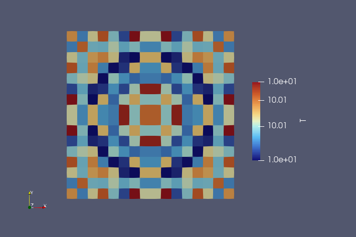

# Adding a source-term

In this tutorial we will see how to implement a simple source-term. Until now, we have seen what [plugins](plugins) were and how to create them. We have also used the `InitialConditions_analytical` helper to create an initial condition. Now, we will see how to do the actual hard work, and iterate through the cells of the domain, read data, do some calculations and finally write data.

For this we will follow a very simple example plugin. 

## Isothermal simulation

Let's imagine we want to do an isothermal simulation. We have two ways to do this. Either we compute everything using an isothermal equation of state. That means, solving the hydrodynamics equations without the pressure term as a variable. That is very tempting, but we will save this for another tutorial. Another way of achieving an isothermal simulation is to have a cooling process that cools/heats infinitely fast the domain to the right temperature. Let's try and implement this solution. 

In practice, that means we have a simulation that does the hydrodynamics, then in a second step, rewrites the total energy so that the temperature is fixed to the right value:

$$
\mathbf{U}^n \xrightarrow[]{Hydro} \mathbf{U}^* \xrightarrow[]{Cooling} \mathbf{U}^{n+1}
$$

In this example, the hydrodynamics is as before the compressible Euler equations with an ideal equation of state. We need to introduce the temperature in the equation of state. We choose to write $p=\rho T$. By setting $T$ to a constant defined by the user $T_0$, we can then recompute the pressure using the density of the fluid $p=\rho T_0$.

Now in practice, the cooling we will do will act on the total energy of the fluid. For a given cell, that means our plugin needs to compute the kinetic energy, the corrected pressure which leads to the internal energy and combine them together to get the final total energy. As a reminder, all these terms are written as follows:

$$
E_{tot} = E_k + \rho e_{int} \qquad E_k=\dfrac{1}{2}\rho||\mathbf{u}||^2 \qquad e_{int}=\dfrac{p}{\rho(\gamma-1)}
$$

That means the operations we need to do are the following: 
1. Read $\mathbf{U}^*$ from the grid 
2. Calculate the kinetic energy $E_k^*$
3. Calculate the pressure $p^{n+1}$ using $\rho^*$ and $T_0$
4. Calculate the internal energy $e_{int}^n+1$
5. Calculate the total energy $E_{tot}^{n+1}$ and write it to the grid

Before we can dive into the actual coding, we need to introduce two very important objects: the `UserData` and the `ForeachCell` data-structures.

## The `ForeachCell` data-structure

The first thing we need to know is how to iterate through the cells of the domain. Because we are dealing with AMR data we cannot iterate along each dimension. We use a specific object that allows us to go through the cells of the domain and access the data. This object is the `ForeachCell` object we have been adding to the [plugin constructor](plugins) earlier. The `ForeachCell` object introduces a series of methods to help you iterate through the domain on the **device**. The simplest of those is `foreach_cell` that simply goes through every cell in the domain.  

{: .note}
> **Host vs Device**
>
> Because we are starting to dive deep in the code, you need to be very careful where which data is living. Because Dyablo is made with portability in mind, when you compile for a GPU backend, the physical data and the grid live on the **device**: the GPU. But, the code you write by default executes on the **host**: the CPU.
>
> When compiling for a CPU backend, the device and the host are the same.
>
> However, because the code you write for Dyablo must be portable, you always need to keep in mind that device memory cannot be accessed directly from the host.
```

If we were to use `foreach_cell` we would need to do something like:

```c++
void some_function_in_my_plugin() const {

  ForeachCell &foreach_cell = this->foreach_cell;

  foreach_cell.foreach_cell("Name of the loop", Uin.getShape(),
    KOKKOS_LAMBDA(const ForeachCell::CellIndex &iCell) {
      // Some parallel code here
    });
}
```

That seems a lot, so let's take things piece by piece. Our class has an attribute called `foreach_cell`. We start by creating a reference copy in the method (more on that later). Then, we call the `foreach_cell` method of this `foreach_cell` variable. This method takes three parameters:
1. A name for your loop
2. The shape of the data on which the loop will iterate
3. A *lambda* to apply to every cell in the domain

Point #1 is obvious, we will talk about #2 in the next section, so let's talk about the lambda.

The lambda is a locally defined function that is going to be applied to every cell in the domain. We use the helper `KOKKOS_LAMBDA` that defines everything correctly for us. As you can see the lambda takes one parameter, a `ForeachCell::CellIndex`. This is a structure that indicates which cell is being currently investigated by the lambda. We will see more about this object in a future tutorial, but for now, just know that it is a structure that allows you to read and write data to a precise location in the grid.

While the surrounding code is executed on the host, the code inside the lambda will be running on the device. That means you are allowed to access the data stored on the grid there ! We will now see how.

## The `UserData` data-structure.

In Dyablo, the physical fields are stored into a large class object called `UserData`. You cannot directly access the fields in the `UserData` object. Instead you ask the `UserData` for a list of fields by name and a corresponding integer ID. When doing so, the `UserData` provides you another object, a `FieldAccessor` which is the object you will use in computing kernels to access the physical data. In summary, you ask the `UserData` for a list of couples (field name, id) and it will return a `FieldAccessor` that will allow you to access this data on the device.

Let's imagine in the previous example, we want to define two field accessor, one for reading data (`Uin`), one for writing data (`Uout`). We would do something like: 

```c++
void some_function_in_my_plugin( UserData &user_data ) const {
  // We create a local enumeration with all the fields in order we want to access them
  enum VarIndex {
    IRHO,
    IE_TOT
  };

  UserData::FieldAccessor Uin  = user_data.getAccessor({ {"rho", IRHO}, {"e_tot", IE_TOT} });
  UserData::FieldAccessor Uout = user_data.getAccessor({ {"rho_next", IRHO}, {"e_tot_next", IE_TOT} });

  ForeachCell& foreach_cell = this->foreach_cell;

  foreach_cell.foreach_cell("Name of the loop", Uin.getShape(),
    KOKKOS_LAMBDA(const ForeachCell::CellIndex &iCell) {
      // Something in parallel here
    });
}
```

Now `Uin` and `Uout` can be used inside the `KOKKOS_LAMBDA` to access the data. Here we ask Dyablo to provide us an access to the variables `rho` and `e_tot`. The other variables will not be accessible since we did not ask explicitely for them.

{: .note}
> **The `var_next` convention**
>
> In Dyablo we store in memory twice every field. The current value, and the value for the next timestep.
> To access the value at the current time, use the name of the variable (eg `rho`).
> To access the value at the next time, use the name of the variable with `_next` (eg `rho_next`).

Finally, now that we have these objects, we can read from them, and do some calculations. For instance, let's imagine we have a plugin that doubles the density and divides by three the energy, we would proceed as follows:

```c++
void some_function_in_my_plugin( UserData &user_data) const {
  // We create a local enumeration with all the fields in order we want to access them
  enum VarIndex {
    IRHO,
    IE_TOT
  };

  UserData::FieldAccessor Uin  = user_data.getAccessor({ {"rho", IRHO}, {"e_tot", IE_TOT} });
  UserData::FieldAccessor Uout = user_data.getAccessor({ {"rho_next", IRHO}, {"e_tot_next", IE_TOT} });

  ForeachCell& foreach_cell = this->foreach_cell;

  foreach_cell.foreach_cell("Name of the loop", Uin.getShape(),
    KOKKOS_LAMBDA(const ForeachCell::CellIndex &iCell) {
      // Reading and calculating the new values
      const real_t rho   = Uin.at(iCell, IRHO)   * 2.0;
      const real_t e_tot = Uin.at(iCell, IE_TOT) / 3.0;

      // Writing the new values to the user data
      Uout.at(iCell, IRHO)   = rho;
      Uout.at(iCell, IE_TOT) = e_tot;
    });  
}
```

Good ! We can now move on with our example.

## Writing a plugin that iterates through the domain

Create a new `SourceUpdate_isothermal_cooling.cpp` in `core/src/source_terms` and add the boilerplate for the plugin creation: 

```c++
#include "SourceUpdate_base.h"

namespace dyablo {

class SourceUpdate_isothermal_cooling : public SourceUpdate {
private:
  ForeachCell& foreach_cell;
  Timers& timers;

  const real_t T0;     // Cooling temperature
  const real_t gamma0; // Adiabatic index
  const int    ndim;   // Number of dimensions
public:
  SourceUpdate_isothermal_cooling(
    ConfigMap &configMap, 
    ForeachCell &foreach_cell,
    Timers &timers) 
  : foreach_cell(foreach_cell), 
    timers(timers),
    T0(configMap.getValue<real_t>("isothermal_cooling", "T0", 100.0)),
    gamma0(configMap.getValue<real_t>("hydro", "gamma0", 1.66666667)),
    ndim(configMap.getValue<real_t>("mesh", "ndim", 2))
  {}

  void update( UserData &U, ScalarSimulationData &scalar_data)
  {

  }
};
} // namespace dyablo

FACTORY_REGISTER( dyablo::SourceUpdateFactory,
                  dyablo::SourceUpdate_isothermal_cooling,
                  "SourceUpdate_isothermal_cooling");
```

and add the file to `core/src/CMakeLists.txt`.

Now we need to do something in the `update` function. First, we need our accessors. We will work on the data that is coming out from the hyperbolic update, so we need the conservative update of the next time step `rho_next`, `rho_vx_next`, `rho_vy_next`, `rho_vz_next` and `e_tot_next`. We will be using the same field accessor to read and to write the data :

```c++
void update( UserData &U, ScalarSimulationData &scalar_data)
{
  ForeachCell &foreach_cell = this->foreach_cell;

  enum VarIndex {
    IRHO, 
    IRHO_VX,
    IRHO_VY,
    IRHO_VZ,
    IE_TOT
  };

  UserData::FieldAccessor Uout = U.getAccessor ({ {"rho_next",    IRHO},
                                                {"rho_vx_next", IRHO_VX},
                                                {"rho_vy_next", IRHO_VY},
                                                {"rho_vz_next", IRHO_VZ},
                                                {"e_tot_next",  IE_TOT} });
```

Now that we have access to the fields of the user data, we can go through the `foreach_cell`, read the data, calculate the new energy, and store it to the grid:

```c++

foreach_cell.foreach_cell("Isothermal cooling", Uout.getShape(), 
  KOKKOS_LAMBDA(const ForeachCell::CellIndex &iCell) {
    const real_t rho    = Uout.at(iCell, IRHO);
    const real_t rho_vx = Uout.at(iCell, IRHO_VX);
    const real_t rho_vy = Uout.at(iCell, IRHO_VY);
    const real_t rho_vz = (ndim == 2 ? 0.0 : Uout.at(iCell, IRHO_VZ));
    
    const real_t Ek = 0.5 * (rho_vx*rho_vx+rho_vy*rho_vy+rho_vz*rho_vz) / rho;
    const real_t eint = rho * T0 / (gamma0-1.0);

    Uout.at(iCell, IE_TOT) = Ek + eint;
  });
```

If you try to build on CPU you should be able to make dyablo without any compilation errors or warnings. If you try this on GPU you will get a lot of warnings. The reason for that is that all the variables and constants you use in the `KOKKOS_LAMBDA` should be local to the `update` function. Here, for instance, we use `ndim`, `gamma0` and `T0`, but these are attributes of the class. We should copy them locally to the function to avoid any problem. This is actually what we did with the line `ForeachCell& foreach_cell = this->foreach_cell`. Simply add before the call to `foreach_cell` the following lines:

```c++
auto ndim = this->ndim;
auto gamma0 = this->gamma0;
auto T0 = this->T0;
```

Now compiling on GPU should go smoothly !

### Running an example

Hopefully, now you should have a new source term available ! Let's try this. In the `build/dyablo/bin` folder open `test_blast_2D_block.ini` and add the following lines at the end of the file: 

```ini
[source_terms]
updates=SourceUpdate_isothermal_cooling

[isothermal_cooling]
t0=10.0
```

Now run the blast and open the result in paraview. Let's plot the temperature.
Add a calculator to your file. In `Result array name` type `p` and in the field below type the following formula: `(e_tot - 0.5 * (rho_vx^2 + rho_vy^2)/rho) * 0.666666667`. Apply, then create another calculator after the first one. In `Result array name` type `T` and in the formula `p/rho`. 

The initial condition is not isothermal, but the last snapshot should be. If you plot `T` in the last snapshot, you should end with something that is around 10.0 (more or less numerical noise): 



Congratulations ! You made a plugin that iterates and modifies cells of the grid !
